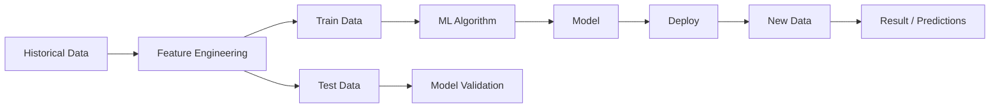

## 🍷 Wine Rating Prediction

In this code, I perform a predictive analysis to answer that question using Linear Regression...
In order to better organize our supervised analysis, I will break it down into the following steps:
1. Load libraries;
2. Load data;
3. Splitting the data into training and testing sets;
4. Model building;
5. Model Evaluation.

-----

### 1. Load libraries

      import pandas as pd
      import numpy as np
      import scipy.stats as st
      import matplotlib.pyplot as plt
      import mpl_scatter_density
      from sklearn.model_selection import train_test_split
      from sklearn.linear_model import LinearRegression
      from sklearn.metrics import mean_squared_error

### 2. Load data

    df = pd.read_csv('red_wine.csv', encoding='latin1')

### 3. Splitting the data into training and testing sets

    x_train, x_test, y_train, y_test = train_test_split(df[['wine_year', 'wine_price']], df['wine_rating']), test_size=0.3266, random_state=33

### 5. Model building

    mod = LinearRegression()
    # mod = LinearRegression() creates a linear regression model and attachs it to a variable called "mod".

    mod.fit(x_train,y_train)
    # The model learns the relationship between x_train (features) and y_train (target). For linear regression, it finds the best coefficients (slopes) and intercept that minimize the error.

### 6. Model Evaluation

    y_prev = mod.predict(x_test)
    # You may be wondering, what the first line means? mod.predict(x_test) is using the features in x_test and predicting the numeric target and saving in y_prev.

    mean_squared_error(y_test, y_prev)
    # mean_squared_error calculates the error between the test values and the predictions. If the MSE is 0, it's perfect! If it's small, it's a good model. If it is too high, it's a bad model :(

  #### Let's analyse the real data vs predicition data which we built.
    ev = pd.DataFrame({"prev": y_prev, "real": y_test})
    ev.head(n=10)

    ev.['erro_absoluto'] = y_prev-y_test
    ev.['erro_relativo'] = (y_prev-y_test)/y_test
    ev.head(n=10)

    ev.hist('erro_absoluto')
    # In this histogram, we have a Gaussian distribution. As we can see, our Linear Regression algorithm has a -0.5 to 0.5 prediction error. Then the question arises: is this good or bad? Is this data useful?

#### We can also verify our model acuracy with dispersion
    fig = plt.figure() # It creates a figure (canvas/window) where the plot will be drawn.
    ax = fig.add_subplot(1, 1, 1, projection='scatter_density') # It creates a 1x1 grid and adds one axes object to that grid.
    ax.scatter_density(y_prev, y_test, color='red') # It creates a density scatter plot: regions with more overlapping points appear more intense.
#### Confidence Interval (CI) for the mean error. We calculate a 95% confidence interval for the mean prediction error: (-0.397, 0.395).
    #   We are 95% confident that the TRUE MEAN ERROR of our model falls between -0.397 and 0.395.
    # Note:
    #   This is NOT the same as saying "95% of individual predictions have an error less than 0.397".

    data = ev.[['erro_absoluto']].to_numpy()

    ci = st.t.interval(
    alpha=0.95, # Set the confidence error level of the model to 95%.
    f=len(ev.index)-1, # Calculate degrees of freedom (number of samples minus 1).
    loc=np.mean((data)), # Calculate the mean (average) of the data.
    scale=np.std(data)) # Calculate the standard deviation of the data.

    print(ci)

    ev.plot.scatter(x='prev', y='prev') # An upward sloping straight line, like this one means a perfect prediction.

    ev.plot.scatter(x='prev', y='real') # # Let's analyse our prediction x real data.

    ev[['prev', 'real']].corr() # It calculates the correlation among the columns.

#### Using a loss function to calculate our model's accuracy.
    # A loss function is like a thermometer that compares the error between the prediction and the real data, and calculates the distance between the errors.
    ev['erro_quadrado']=ev['erro_absoluto']**2
    ev
    #Quadratic = number squared

#### Error metrics calculation
    SSE = sum(ev['erro_quadrado']) # It calculates the sum of the errors. The smaller the error, the better our model prediction is.
    MSE = ev['erro_quadrado'].mean() # It calculates the mean of the errors. The smaller the mean, the better our model prediction is.
    RMSE = np.sqrt(MSE)

    MSE_sklearn = mean_squared_error(y_test, y_prev) # MSE utilizing sklearn.
    [SSE, MSE, RMSE, MSE_sklearn]
    

